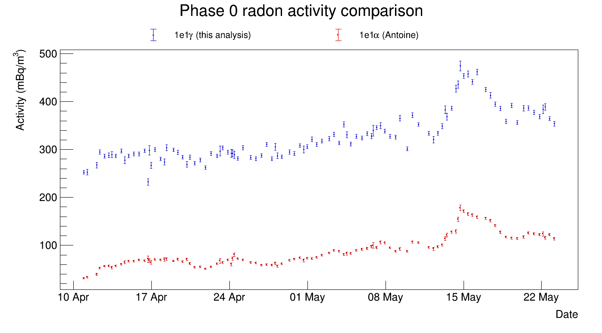
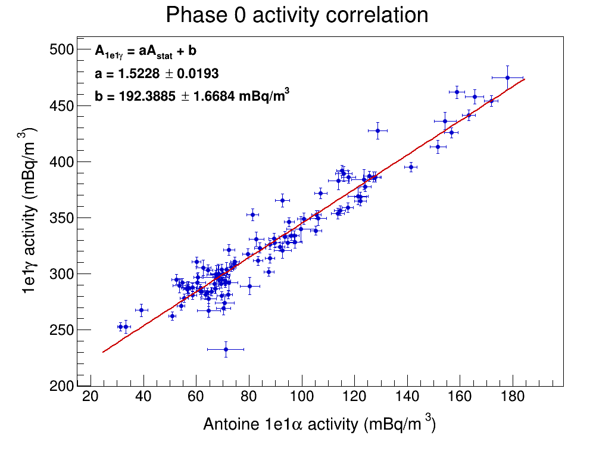
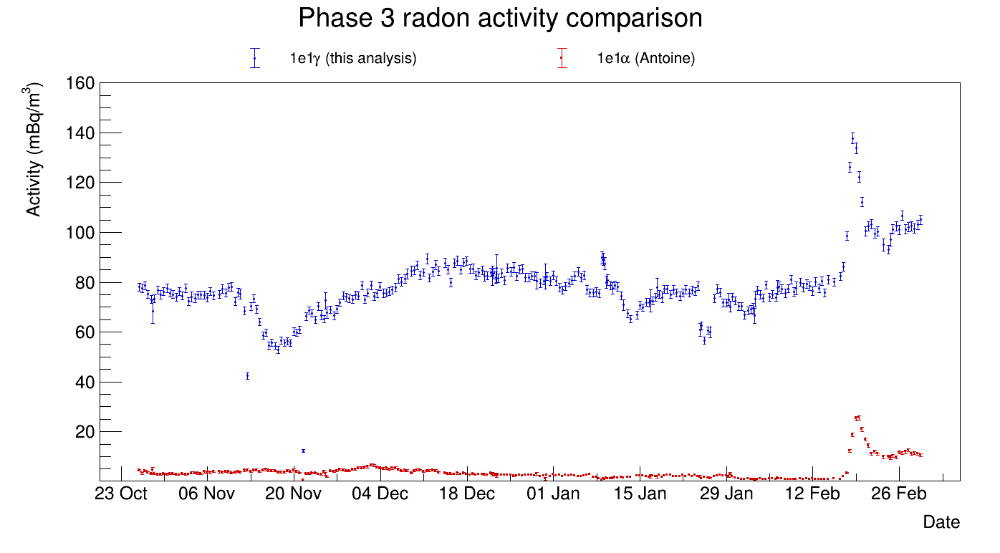
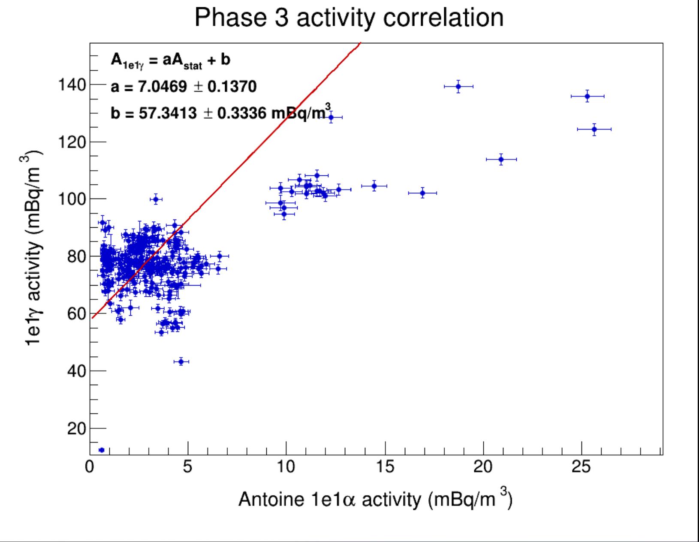

# Measurement of Off-Plane Radon Activity Using the 1e1γ Channel

This repository contains a modularised version of the ROOT/C++ analysis developed for my MSc dissertation in Particle and Nuclear Physics at the University of Edinburgh.

The project investigated whether the **1e1γ decay channel of ²¹⁴Bi** could provide an independent method for measuring **²²²Rn activity within the SuperNEMO Demonstrator tracker**. Radon and its progeny are important backgrounds in searches for neutrinoless double-beta decay (0νββ), making their accurate measurement and mitigation essential.

The analysis was performed using **Phase 0 and Phase 3 SuperNEMO data** and was compared with the established **1e1α (BiPo) radon analysis**.

## Physics motivation

SuperNEMO searches for neutrinoless double-beta decay using a tracker-calorimeter detector capable of reconstructing particle trajectories, energies and timing information.

Radon contamination is an important background because its progeny, particularly **²¹⁴Bi**, can produce event topologies similar to those expected from 0νββ.

The established BiPo analysis identifies ²¹⁴Bi through the characteristic 1e1α signature, consisting of an electron followed by an alpha particle originating from the same location. This project investigated an alternative channel in which ²¹⁴Bi undergoes beta decay to an excited state of ²¹⁴Po, followed by gamma emission, producing a **one-electron–one-gamma (1e1γ)** topology.

## Analysis

The analysis was applied to **502 experimental data runs** together with simulated ²¹⁴Bi decays on the tracker wires.

Candidate 1e1γ events were identified through a sequential selection based on the reconstructed event topology, detector geometry, calorimeter timing and reconstructed energy.

The principal selection stages were:

1. **Photon-energy pre-cut**
   - Phase 0: `Eγ > 0.300 MeV`
   - Phase 3: `Eγ > 0.050 MeV`

2. **1e1γ topology**
   - Exactly one reconstructed electron
   - Exactly one reconstructed gamma

3. **Calorimeter timing**
   - `−20 ns ≤ calo_tdc ≤ 300 ns`

4. **Geometry selection**
   - Main-Wall optical modules
   - `77 mm < |x| < 337 mm`
   - `−2000 mm < y < 1900 mm`

5. **Time-of-flight selection**
   - Electron and gamma propagation times are reconstructed from their detector geometry and measured calorimeter times.
   - Candidate events satisfy:

     `Δt < 12 ns`

6. **Total-energy selection**
   - `E_e + E_γ < 3.000 MeV`

The code reports a sequential cut flow showing the number of events surviving each stage of the selection.

## Time-of-flight reconstruction

The electron velocity is calculated relativistically from its reconstructed kinetic energy. The electron and gamma flight times are then removed from their measured calorimeter times.

The timing variable used for the selection is

`Δt = |(t_e,calo − L_e/v_e) − (t_γ,calo − L_γ/c)|`

where `L_e` and `L_γ` are the reconstructed electron and gamma path lengths.

Events with `Δt < 12 ns` are retained.

## Radon activity

For each data run, the ²²²Rn activity is calculated from the number of selected 1e1γ events:

`A = N_selected / (t × V × ε)`

where:

- `N_selected` is the number of events surviving the complete selection,
- `t` is the run duration,
- `V = 15.4 m³` is the tracker volume,
- `ε` is the phase-dependent selection efficiency.

The efficiencies obtained for the analysis were:

- **Phase 0:** `ε = 3.191%`
- **Phase 3:** `ε = 3.366%`

Activity is reported in `mBq/m³`.

## Results

The 1e1γ activity measurements were compared with the established 1e1α (BiPo) measurements independently for Phase 0 and Phase 3. Two complementary comparisons were performed: the evolution of the measured radon activity with time and the run-by-run correlation between the two measurements.

### Phase 0



The Phase 0 measurements show that the 1e1γ activity follows the same time-dependent behaviour as the independent 1e1α measurement. In particular, the increase in activity during May is reproduced by both analyses. However, the absolute activity measured using the 1e1γ channel is systematically higher.



A run-by-run comparison shows a clear positive correlation between the two measurements. A linear fit,

`A_1e1γ = a A_1e1α + b`

gives:

- `a = 1.2171 ± 0.0170`
- `b = 95.4762 ± 1.4648 mBq/m³`

The positive correlation demonstrates that the 1e1γ measurement responds to changes in radon activity. The substantial positive intercept, however, indicates an additional contribution to the selected 1e1γ event rate.

### Phase 3



An important difference between the two data-taking periods was the installation of the **anti-radon tent before Phase 3**, which was designed to reduce radon entering the detector. A reduction in radon activity relative to Phase 0 is therefore expected.

This reduction is observed in both independent measurements. The 1e1α (BiPo) activity is substantially lower in Phase 3 than in Phase 0, and the 1e1γ analysis reproduces the same overall reduction. This provides further evidence that the 1e1γ channel is sensitive to changes in radon activity within the tracker.

The 1e1γ measurement nevertheless remains systematically higher than the BiPo measurement.



The Phase 3 correlation gives:

- `a = 7.0469 ± 0.1370`
- `b = 57.3413 ± 0.3336 mBq/m³`

A positive relationship between the two measurements remains visible in Phase 3. However, the substantially different scale and non-zero intercept indicate that the selected 1e1γ sample contains additional contributions beyond the radon signal measured by the BiPo analysis.

### Interpretation

Across both detector phases, the 1e1γ analysis reproduces the overall variation in radon activity observed independently by the established BiPo analysis. Importantly, it also reproduces the reduction in activity between Phase 0 and Phase 3 following the installation of the anti-radon tent.

These results demonstrate that the 1e1γ topology contains a measurable component associated with radon activity. However, the systematically higher reconstructed activities indicate that additional processes contribute to the selected 1e1γ sample.

One possible contribution is **²¹⁴Pb**, which belongs to the same ²²²Rn decay chain. The beta decay of ²¹⁴Pb can leave ²¹⁴Bi in an excited state, followed by gamma emission, potentially producing the same electron-gamma topology required by the 1e1γ selection. Since ²¹⁴Pb and ²¹⁴Bi are expected to be in secular equilibrium, their activities vary together. A ²¹⁴Pb contribution could therefore increase the activity inferred by the 1e1γ method while still allowing it to track changes in the underlying radon activity.

In contrast, the delayed electron-alpha signature used by the BiPo analysis is more specific to the ²¹⁴Bi–²¹⁴Po decay sequence and is therefore less susceptible to this contribution.

The 1e1γ channel therefore provides sensitivity to variations in radon activity, but additional background contributions must be understood and modelled before it can be used as an independent precision measurement of ²²²Rn activity.

## Future work

Future work should focus on identifying and quantifying the additional background contributions to the selected 1e1γ sample. In particular, simulating potential contributions from **²¹⁴Pb** would help determine whether decays within the ²²²Rn chain can explain the systematically higher activity measured by the 1e1γ analysis.

## Repository structure

```text
SuperNEMO/
│
├── src/
│   ├── EventSelection.C
│   ├── ActivityAnalysis.C
│   ├── RunUtilities.C
│   └── Plotting.C
│
├── plots/
│   ├── phase0/
│   └── phase3/
│
├── README.md
└── .gitignore
```

### `EventSelection.C`

Implements the sequential 1e1γ event-selection pipeline, including topology, calorimeter timing, geometry, time-of-flight and total-energy requirements.

### `ActivityAnalysis.C`

Calculates the selected-event efficiency and run-by-run radon activity.

### `RunUtilities.C`

Contains utilities for extracting run information, identifying the detector phase and retrieving run timing information.

### `Plotting.C`

Contains ROOT routines for visualising the principal selection variables and final analysis results, including:

- photon-energy distributions;
- calorimeter timing;
- reconstructed vertex distributions;
- time-of-flight corrected `Δt`;
- total electron-plus-gamma energy;
- 1e1γ/BiPo activity comparison;
- activity correlation and linear fit.

### `plots/`

Contains selected Phase 0 and Phase 3 figures illustrating the event selection and final activity comparisons.

## ROOT input

The analysis reads reconstructed events from a ROOT `TTree` named:

```text
Result_tree
```

Principal branches used include:

- `pid`
- `energy`
- `electron_number`
- `gamma_number`
- `calo_tdc`
- `om_number`
- `first_vertex_x/y/z`
- `vertex_track_first_end_x/y/z`
- `vertex_extrapolation_calo_x/y/z`
- `gamma_om_x/y/z`

The particle-ID convention is:

- `pid = 0` → gamma
- `pid = 1` → electron

## Software

The analysis was developed in **C++ using CERN ROOT** and uses ROOT functionality including:

- `TChain`
- `TH1D` / `TH2D`
- `TGraphErrors`
- `TMultiGraph`
- `TF1`
- `TCanvas`

## Scope of this repository

This repository is intended to provide a **representative and readable implementation of the core analysis**, rather than reproduce every diagnostic and specialised study contained in the complete dissertation analysis framework.

The original analysis was developed using SuperNEMO collaboration data and computing infrastructure. Consequently, the repository does not distribute experimental ROOT datasets or collaboration-internal data products.

## Dissertation

**Measurement of Off-Plane Radon Activity Using the 1e1γ Channel**  
Aryak Karanam  
MSc Particle and Nuclear Physics  
University of Edinburgh, 2026

Supervised by **Dr Cheryl Patrick** and **Dr Xalbat Aguerre**.
